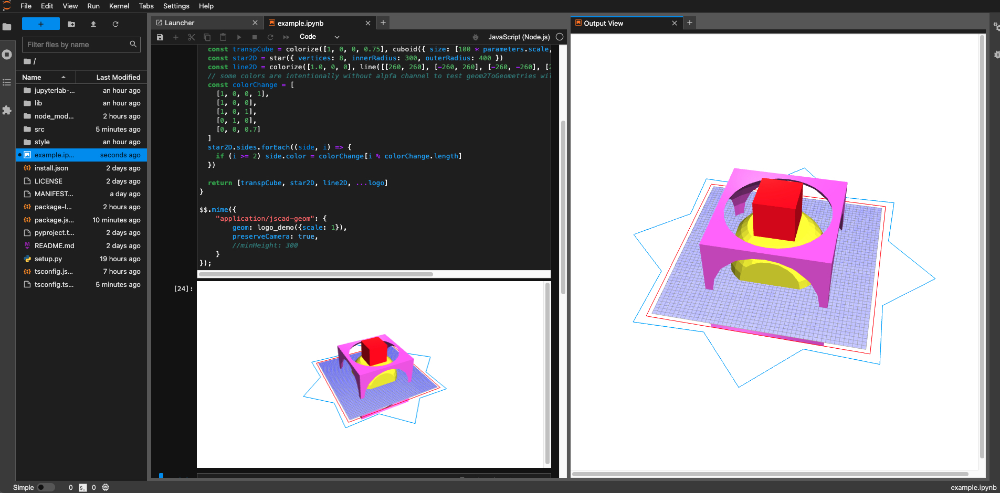

# jupyterlab-jscad

A JupyterLab extension for rendering [JSCAD](https://github.com/jscad/OpenJSCAD.org) geometries. 
Designed to work with [IJavascript](https://github.com/n-riesco/ijavascript) kernel.

JSCAD is a set of tools for creating parametric 2D and 3D designs with Javascript code.



## Requirements

- JupyterLab >= 3.0

## Install

Download the `.whl` from the Release page.

```bash
pip install [path to downloaded .whl file]
```

## Usage

jupyterlab-jscad runs as a MIME renderer extension of JupyterLab.

To render JSCAD geometries in IJavascript:

```javascript
let jscad = require("@jscad/modeling") // @jscad/modeling has been installed globally, with NODE_PATH environment variable set

let { cube } = jscad.primitives

$$.mime({
    "application/jscad-geom": {
        geom: cube({ size: 10 }), // <--- feed output geometries here
        saveCamera: true,         // <--- save camera position
        useLastCamera: true,      // <--- use last saved camera position
        // minHeight: 300,        // <--- set minimum height of the canvas to 300
        // height: 300            // <--- force the height of canvas to be 300
    }
})

// If you don't want such a ceremony, you can define
function jscad_show(geom) {
    $$.mime({
        "application/jscad-geom": {
            geom,                     // <--- feed output geometries here
            saveCamera: true,         // <--- save camera position
            useLastCamera: true,      // <--- use last saved camera position
        }
    });
}

// ... and call
jscad_show(cube({ size: 10 }))
```

## Contributing

### Development install

```bash
jlpm install
jlpm run build
jupyter labextension install . --no-build
```

See tutorials at [https://jupyterlab.readthedocs.io/en/stable/extension/extension_tutorial.html](https://jupyterlab.readthedocs.io/en/stable/extension/extension_tutorial.html)
and [https://github.com/jupyterlab/jupyterlab-mp4/blob/master/tutorial.md](https://github.com/jupyterlab/jupyterlab-mp4/blob/master/tutorial.md)

## Acknowledgment

This project was mainly motivated by [danmarshall/jscad-now](https://github.com/danmarshall/jscad-now).

The idea of using MIME renderer was learned from [n-riesco/ijavascript-plotly](https://github.com/n-riesco/ijavascript-plotly).
Given that `comm` feature haven't been implemented in IJavascript, this would be probably the most straight-forward approach in rendering a model.

The structure of this project is based on examples in [jupyterlab/jupyter-renderers](https://github.com/jupyterlab/jupyter-renderers).


